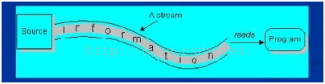
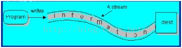
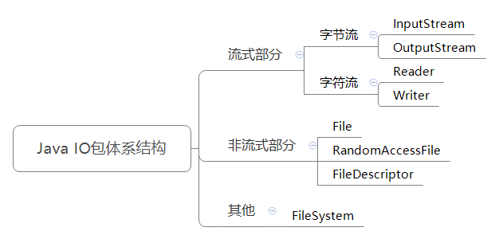
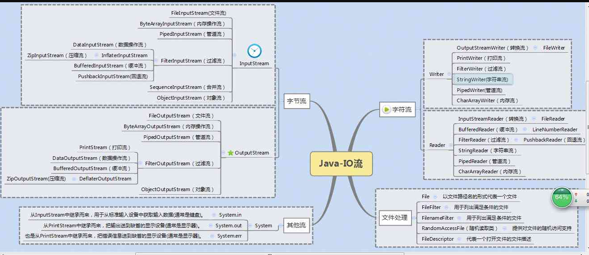
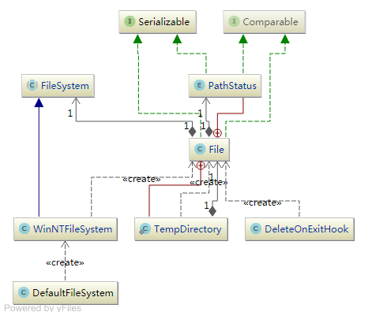
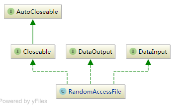
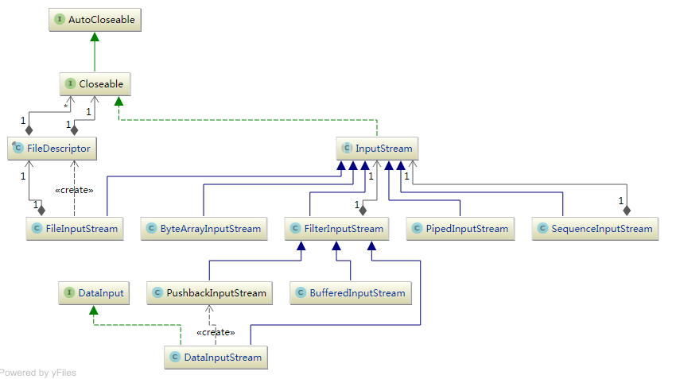
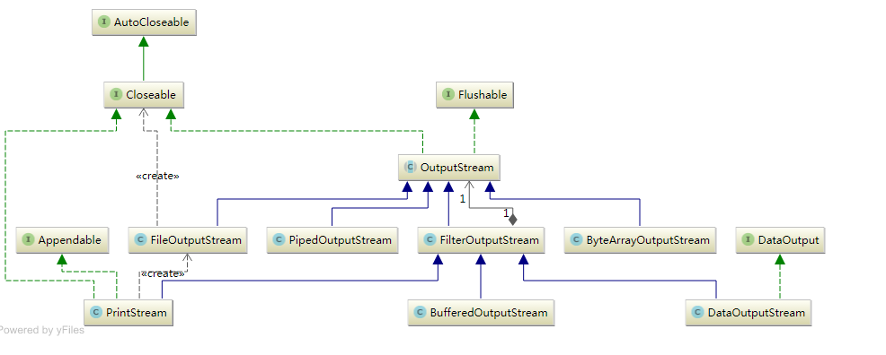
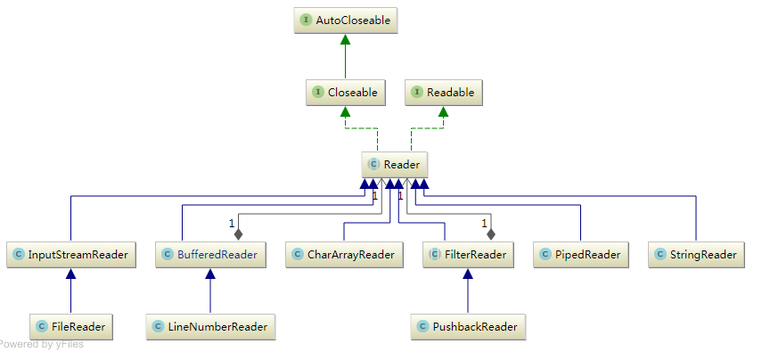
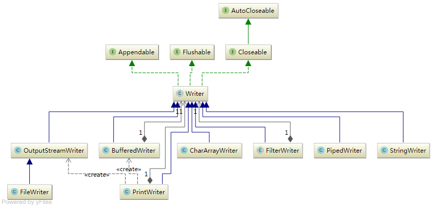

## IO流概述

- 流：代表任何有能力产出数据的数据源对象或者是有能力接受数据的接收端对象
- 流的本质：数据传输，根据数据传输特性将流抽象为各种类，方便更直观的进行数据操作
- 流的作用：为数据源和目的地建立一个输送通道

## IO体系结构
- File：用于文件或者目录的描述信息，例如生成新目录，修改文件名，删除文件，判断文件所在路径等
- InputStream：抽象类、基于字节的输入操作、是所有输入流的父类、定义了所有输入流都具有的共同特征
- OutputStream：抽象类、基于字节的输出操作、是所有输出流的父类、定义了所有输出流都具有的共同特征
- Reader：抽象类、基于字符的输入操作
- Writer：抽象类、基于字符的输出操作
- RandomAccessFile：功能丰富，可以从文件的任意位置进行存取（输入输出）操作

#### 结构图

#### 思维导图

#### UML类图

## 字节流和字符流的区别
1.&nbsp; **字节流没有缓冲区，是直接输出的，而字符流是输出到缓冲区的。因此在输出时，字节流不调用colse()方法时，信息已经输出了，** 
&nbsp;&nbsp;**而字符流只有在调用close()方法关闭缓冲区时，信息才输出。要想字符流在未关闭时输出信息，则需要手动调用flush()方法。** 

2.&nbsp; **读写单位不同：字节流以字节（8bit）为单位，字符流以字符为单位，根据码表映射字符，一次可能读多个字节。**

3.&nbsp; **处理对象不同：字节流能处理所有类型的数据（如图片、avi等），而字符流只能处理字符类型的数据。**

**结论：只要是处理纯文本数据，就优先考虑使用字符流。除此之外都使用字节流**